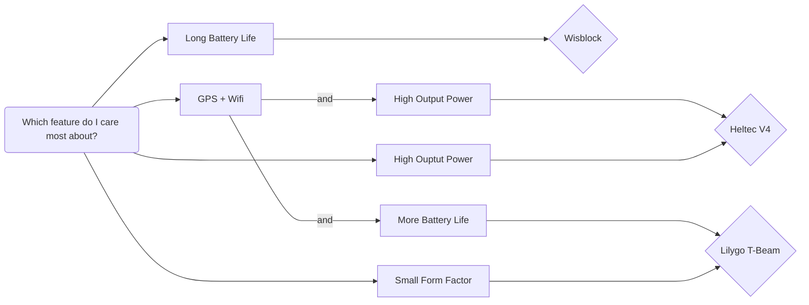

# Buid Day Board Options

## Option A: Wisblock Meshtastic Starter Kit

RAK4631 Core module + RAK19007 Base Board + RAK1921 OLED Display

{: width="300" }

## Option B: Heltec V4

WiFi LoRa 32 (V4), ESP32S3 + SX1262 LoRa Node, Meshtastic and LoRaWAN Compatible + L76K GNSS Module

{: width="300"}

## Option C: Lilygo T-Beam
Lilygo T-Beam Meshtastic

{: width="300" }

## Decision Flowchart

## Full Comparison
| Board | WisBlock Meshtastic Starter Kit | Heltec V4 | Lilygo T-Beam |
| :------- | :----------- | :-------- | :------------ |
| Full Name | RAK4631 Core module + RAK19007 Base Board + RAK1921 OLED Display | WiFi LoRa 32 (V4), ESP32S3 + SX1262 LoRa Node, Meshtastic and LoRaWAN Compatible + L76K GNSS Module | Lilygo T-Beam Meshtastic |
| Link | [WisBlock Meshtastic Starter Kit](https://store.rakwireless.com/products/wisblock-meshtastic-starter-kit?index=6&intsource=rak_store&intmedium=organic&intcampaign=meshtastic_collection_page&intterm=hot_deals&intcontent=product_header&variant=43884034785478) | [Heltec V4](https://heltec.org/project/wifi-lora-32-v4/?attribute_pa_band=902-928mhz&attribute_display=OLED&attribute_transmission-power=28dbm&attribute_warehouse=US+%28United+States%29+Warehouse) | [Lilygo T-beam](https://lilygo.cc/en-us/products/t-beam-meshtastic?variant=45348463280309) |
| Price (Will be covered by club) | $30.99 | $27.90 | $33.15 |
| Microcontroller | Nordic nRF52840 | ESP32-S3R2 | ESP32 |
| Radio Chip | SX-1262 | SX-1262 | SX-1276 |
| TX Power | ~160mW (22dBm) | ~630mW (28dBm) | ~100mW (20dBm) |
| Includes GPS | No | Yes (external module) | Yes |
| WiFi | No | Yes | Yes |
| Screen | 0.96in OLED | 0.96in OLED | 0.96 OLED |
| Est. Battery Life (3000mAh) | ~278 hrs (11 days) | ~10.7 hrs | ~18.75 hrs *Note nust use (one) 18650 cell* |

